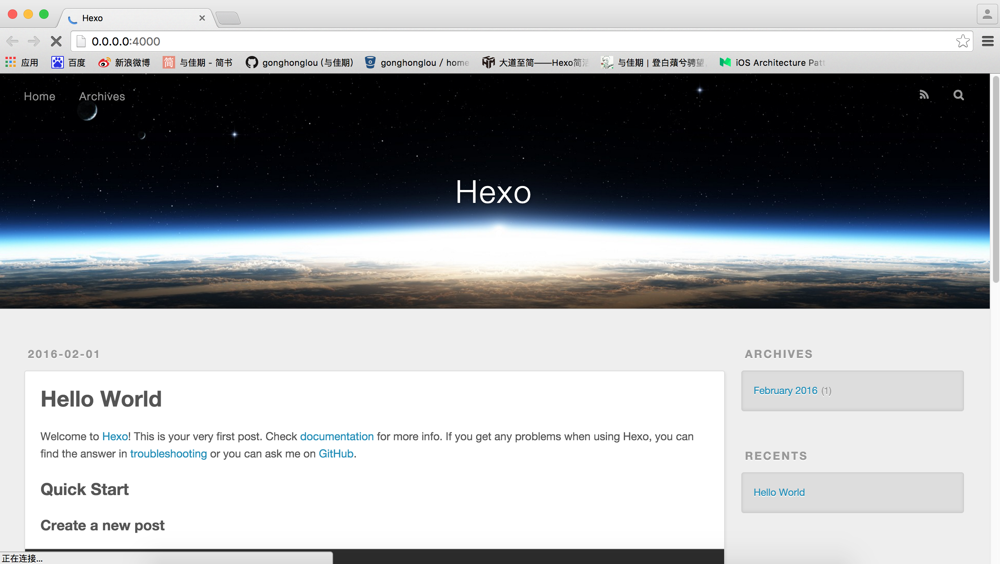
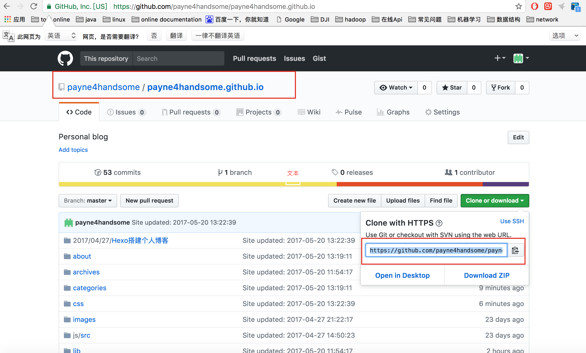

>第一次用Hexo搭建个人博客，原来用的CSDN的博客，但是嫌弃它不够简洁，有点花哨,
所以趁有时间就想自已搭建一个博客。既然是第一篇文章，有必要把Hexo搭建博客的过程写下来

## 安装
安装步骤如下：  
1、安装Hexo需要先安装下面应用程序(**根据自已的系统选择安装方式，window和mac系统直接官网下载安装
，linux用户可以自带的安装程序安装**)：
+ Node.js
+ Git
2、运行如下命令  
+ npm install -g hexo-cli
## 初始化

选择一个目录，执行如下命令：
+ hexo init Hexo    
Hexo 是你建立文件的名称，cd到Hexo的文件，执行如下命令：  
+ npm install    
执行如下命令，就可以开启hexo服务器了（可以在本地访问）：  
+ hexo s   
此时，在浏览器中打开网址http://localhost:4000,就能过看到如下页面


本地设置好了以后，接下来开始设置用github来访问我们的博客  

## 设置GitHub
1、创建仓库  
登录你的Github帐号，新建仓库，名为用户名.github.io固定写法，如payne4handsome.github.io 即下图中1所示：


2、配置部署信息
本地的Hexo的文件内容如下：  

```
_config.yml    
db.json 
node_modules 
package.json
scaffolds
source
themes
```
cd到Hexo的文件写，打开hexo的配置文件_config.xml，在配置文件的最后
做下面的这样的修改（这样hexo d命令可以直接把写的文章部署到我们git仓库上）  

```
deploy:
  type: git
  repository: https://github.com/payne4handsome/payne4handsome.github.io
  branch: master
```
  
## 写博客

hexo命令的基本语法为：  
hexo  <command>  

```
Commands:
  clean     Removed generated files and cache.
  config    Get or set configurations.
  deploy    Deploy your website.
  generate  Generate static files.
  help      Get help on a command.
  init      Create a new Hexo folder.
  list      List the information of the site
  migrate   Migrate your site from other system to Hexo.
  new       Create a new post.
  publish   Moves a draft post from _drafts to _posts folder.
  render    Render files with renderer plugins.
  server    Start the server.
  version   Display version information.

Global Options:
  --config  Specify config file instead of using _config.yml
  --cwd     Specify the CWD
  --debug   Display all verbose messages in the terminal
  --draft   Display draft posts
  --safe    Disable all plugins and scripts
  --silent  Hide output on console
```

比如我们要创建一篇新的博客：
+ hexo new 'hello world'  
然后我们找到Hexo的目录下面的source/_posts目录下面的‘hello world’.md开始编辑（markdown语法）  
+ hexo g (同hexo generate)  
生产静态文件  
+hexo d（同hexo deploy）  
部署到github

## 总结
```
hexo generate --watch //Hexo 能够监视文件变动并立即重新生成静态文件，在生成时会比对文件的 SHA1 checksum，只有变动的文件才会写入。
hexo generate --deploy //和下面的命令一样
hexo deploy --generate
```
上面的两个命令可以简写为：
```
hexo g -d
hexo d -g
```

## Questions
一开始我用的hexo自动Markdown解析器，但是我在vim编辑文章时，如果我在vim中
换行，那么显示的页面就会换行，这样排版会难看（每一行字数可能不一样），那
么需要执行下面命令，安装新的Markdown解析器：
```
npm un hexo-renderer-marked --save
npm i hexo-renderer-markdown-it --save
```

